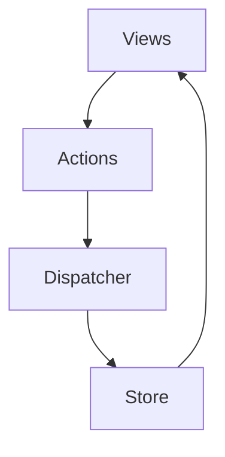
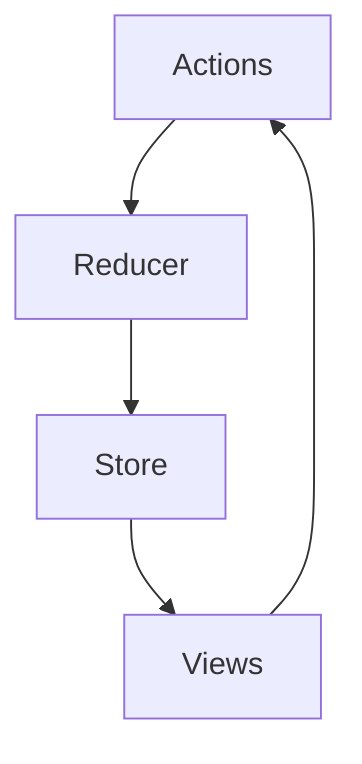

## DIO - Introdução a Redux com ReactJS

Aula ministrada por Renato Benkendorf.

## Introdução

`React` é uma biblioteca declarativa e flexível, baseada em componentes (pequenos e isolados códigos) que podem ser reutilizáveis para criar interfaces.

`Redux` é um contêiner (bloco) de estado previsível para aplicativos JS. É uma forma de manter estados centralizados e fáceis de testar e controlar.

## Influências

### A linguagem Elm

Elm é uma linguagem funcional, fortemente tipada e que compila para JavaScript, HTML e CSS.

A influência desta linguagem sobre o redux são o conceito de imutabilidade, API declarativa, operações determinísticas e controle de efeitos colaterais (quando não se pode evitá-los).

#### Imutabilidade

Significa algo que não pode ser alterado.

Ao criar algum objeto, por exemplo, o mesmo não deve sofrer alterações em seu estado, mas ele pode ser copiado, para assim obtermos um novo objeto com os dados atualizados.

#### Operações determinísticas

É um processo de causa e efeito, ao qual temos um conjunto de entradas conhecido, resultando em uma saída previsível. Ex: funções puras.

#### Efeitos colaterais

Side Effects ou efeitos colaterais são alterações no estado da aplicação que são percebidos fora do escopo da função chamada.

### A arquitetura Flux

Essa arquitetura, indica como devemos estruturar nossa aplicação de modo que o padrão siga um fluxo de dados unidirecional.

Ela foi criada como uma solução para o problema de gerenciar estado que deve ser compartilhado entre diferentes componentes.

- A view é a interface do usuário, renderiza e cuida das interações com o usuário e é de onde partem as chamadas para criar as actions.

- As actions são os eventos que passam os dados para as dispatcher.

- Dispatcher (despachar em português) é o gatilho para receber dados e os enviar para os stores.

- Na Store, ficam os dados e lógica da aplicação.Nela, recebemos as actions contendo os dados e emitimos eventos que irão atualizar os dados dos estados, fazendo com que as views sejam renderizadas novamente.

## Princípios do Redux

O Redux é composto por 3 princípios:

### Uma única fonte de verdade

Todo o estado da aplicação é mantido em apenas um único objeto chamado de Store.

### O estado disponível apenas para leitura

O estado da aplicação usa o conceito de imutabilidade, ou seja, a única maneira de alterar o estado é emitir uma Action (um objeto descrevendo o que aconteceu).

### Mudanças são feitas apenas por funções puras

Os Reducers recebem Actions emitidas e aplicam-nas ao estado, retornando um novo estado.

## Arquitetura Redux

### Actions

São objetos que servem para transmitir o que será enviado de sua View para sua Store.

Elas possuem uma propriedade `type` que indica o tipo de ação que será executada e podem ter a propriedade `payload` que significa carga útil, ou seja, o conteúdo que será útil naquela ação.

### Reducers

São 'pedaços' que nos permite saber o valor atual do estado e são a única maneira de alterar os estados no Redux.

A função redutora aceitará 2 valores; o estado anterior do aplicativo e a Action que está sendo despachada.
Depois, calculará o próximo estado e retornará o novo objeto.

Precisamos dar um valor inicial ao estado na função redutora para que o valor não inicie como `undefined`.

O Reducer será responsável por criar a cópia do estado e enviá-lo à Store.

### Store

Têm a responsabilidade de manter o estado da aplicação, permitir a leitura do estado e permitir que o estado seja alterado pelos Reducers.

Para manter a centralização dos estados, precisamos criar a Store e concatenar os Reducers nele.

### View

É a parte visual, que interage com o usuário renderiza o estado do Store e conecta com o despacho de ações que alteram um estado.

## Middleware

O middleware é uma 'camada' entre a Action e o Reducer que pode transformar, atrasar, cancelar, ignorar ou interpretar ações ou ações assíncronas.

É útil para registrar ações, relatar falhas, realizar efeitos colaterais como roteamento ou transformar uma chamada de API assíncrona em uma série de ações síncronas.

## @reduxjs/toolkit

É um conjunto de ferramentas para o desenvolvimento do Redux.

Serve para simplificar configurações de Store, criação de reducers e atualizações de lógicas imutáveis.

Também ajuda a diminuir a quantidade de códigos repetitivos (boilerplate), permitindo se concentrar na lógica principal e trabalhar com menos código.

### Facilidades:

Esse conjunto de ferramentas possui uma abstração da função createStore do Redux, chamada de `configureStore`.

`configureStore` aceita um único parâmetro de objeto de configuração com algumas opções:

- Reducer:

  Se for única, será usada como o redutor raiz para a Store.

  Se for como um objeto de vários redutores, o configureStore criará automaticamente o redutor raiz passando esse objeto para o combineReducers.

- Middleware

  Essa opção deverá conter todas as funções de middleware que deseja adicionar à Store, o configureStore passará automaticamente aqueles para applyMiddleware e não adicionará nenhum middleware extra além do que você listou.

  Se não for fornecido, configureStore chamará getDefaultMiddleware que contém o Redux Thunk.

        - Redux Thunk é um middleware que permite retornar funções, em vez de apenas ações, dentro do Redux, permitindo também trabalhar com ações de forma assíncrona.

  Para saber mais sobre o [getDefaultMiddleware](https://redux-toolkit.js.org/api/getDefaultMiddleware).

- DevTools:

  Suporte para a extensão do navegador Redux DevTools.

## Outras simplificações:

- createReducer

  É um utilitário que simplifica a criação de funções de redução do Redux.

  Permite escrever códigos de forma mais imperativa, pois eles serão empacotados com os recursos de substituição funcional da biblioteca de imutabilidade Immer.

- createAction

  Remove a necessidade de criar as ações como uma função que tem um `type` e `payload`.

- createSlice (reducer + actions)

  É uma função que aceita um nome, um estado inicial e um objeto de funções de redutoras e gera criadores de ação e tipos de ação que correspondem aos redutores e ao estado.

- createSelector

  É um utilitário da biblioteca Reselect.

  Selector é uma função que aceita a árvore de estado do Redux como um argumento e retorna alguns dados extraídos ou derivados.

## Create React App e Redux

Este projeto foi inicializado com [Create React App](https://github.com/facebook/create-react-app), usando o template do [Redux](https://redux.js.org/) e o [Redux Toolkit](https://redux-toolkit.js.org/).

Este projeto já vem com um template exemplificando um contador com a implementação sobre Redux.

## Modo de desenvolvimento

Para rodar a aplicação em modo de desenvolvimento rode o comando `npm start`.\
Abra [http://localhost:3000](http://localhost:3000) para visualizar no seu navegador.

A página irá recarregar quando você fizer modificações.
