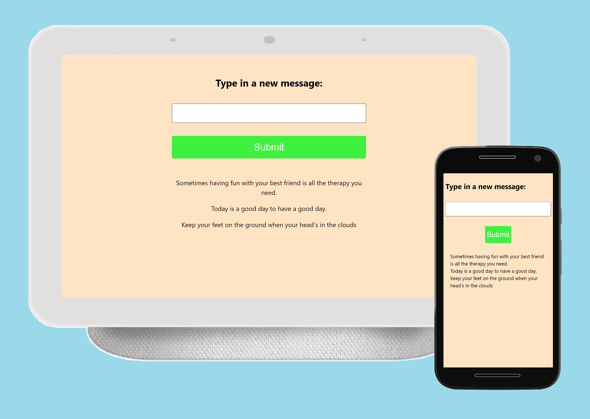

<h1 align="center">
  
</h1>

## Redux-messages

Este projeto tem o objetivo de treinar os conceitos sobre redux.

A aplicação exibe um campo input e adiciona novas mensagens a uma lista.

O estado das mensagens, assim como a ação de adicionar elas são gerenciados usando o Redux.
